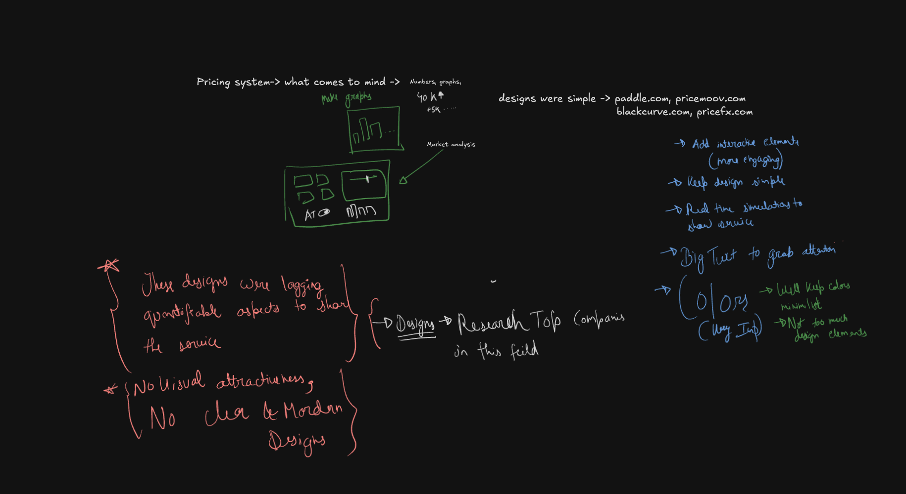
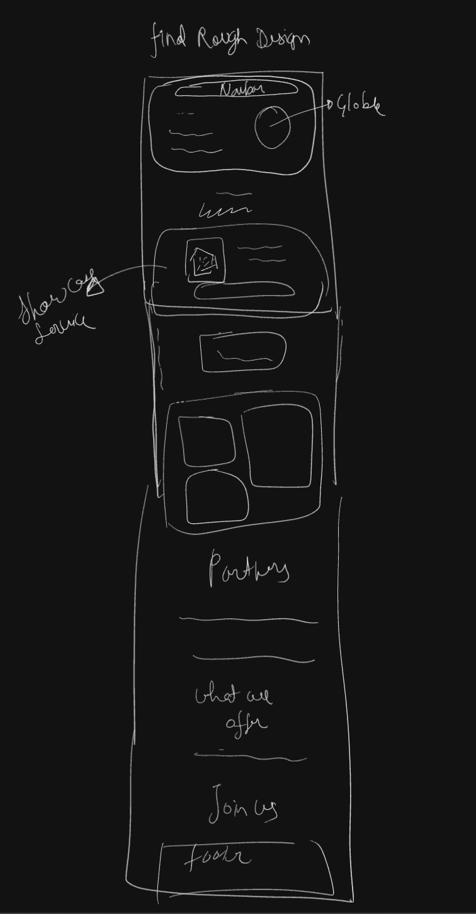

# Malfoy

Malfoy is a Next.js application I built for advanced pricing intelligence and dynamic pricing strategies.

## Demo Video

<iframe src="https://drive.google.com/file/d/1RthMa1fOZTUseWTqpuz6jfmj_Bihntpa/preview" width="640" height="480" allow="autoplay"></iframe>



*My initial brainstorming and competitive analysis*

## Overview

Malfoy provides powerful pricing analytics and visualization tools to help businesses make data-driven pricing decisions. The application features interactive elements and real-time simulations that demonstrate pricing impact, making complex data actionable for users.


*My initial rough design sketches that guided the final implementation*

## Design Philosophy

My design approach focuses on clarity and functionality while maintaining visual appeal. The development process began with extensive research and sketching to ensure the final product solves real user problems while being intuitive to navigate.

### Design Inspiration

- **Competitive Analysis**: I studied successful platforms like paddle.com, pricemoov.com, blackcurve.com, and pricefx.com to understand common patterns and identify differentiation opportunities
- **Dribbble Inspiration**: I sourced modern dashboard designs from Dribbble, particularly [this aviation procurement platform](https://dribbble.com/shots/24127094-Looper-Website-design-for-the-aviation-procurement-platform), which influenced my approach to presenting complex data in digestible formats
- **Design Process**: I did not create detailed Figma designs, but instead made rough sketches and referenced designs on Dribbble to guide my implementation. This approach allowed for greater flexibility during development while still maintaining design coherence
- **Key Design Principles**:
  - Maintain simplicity while adding engaging interactive elements
  - Use vibrant but purposeful colors to highlight important data
  - Implement real-time simulations for immediate feedback
  - Employ large typography for important metrics to grab attention

### UX Strategy

I approached the UX with careful consideration of the user journey:

- **Information Architecture**: Organized around a navbar-based navigation with clearly defined sections for intuitive access
- **Interactive Elements**: Added dynamic components that respond to user input for a more engaging experience
- **Microinteractions**: Implemented subtle animations that provide feedback on user actions
- **Visual Hierarchy**: Used size, color, and positioning to guide users to the most important information first

## Tech Stack & Architecture

I made deliberate technology choices based on scalability, performance, and developer experience:

- **Frontend**: Next.js with React components
- **Backend**: Node.js API routes with Prisma ORM
- **Database**: PostgreSQL (Neon Database) for reliable cloud-native data storage
- **Authentication**: Implemented both Google OAuth and custom email/password signup with email verification
- **State Management**: React Context API with hooks for global state
- **Data Fetching**: TanStack Query for efficient server state management and caching
- **Styling**: Tailwind CSS for consistent design language and rapid development
- **Visualization**: Custom chart components for pricing data visualization
- **UI Components**: Leveraged high-quality components from magicui.design, 21st.dev, and shadcnblocks.com
- **Scheduling**: Integrated Calendly for meeting scheduling capabilities
- **Deployment**: AWS infrastructure with Docker-optimized setup for both development and production environments

### Tech Decisions

- **PostgreSQL**: I chose PostgreSQL for its reliability, ACID compliance, and extensive feature set. PostgreSQL's advanced capabilities like JSON support, powerful indexing, and complex query functionality make it ideal for a data-intensive application like Malfoy. The Neon Database serverless implementation allows for easy scaling and management.
- **TanStack Query**: I implemented TanStack Query to handle server state management because it dramatically simplifies data fetching, caching, and synchronization. This improves both performance and user experience by reducing unnecessary network requests and providing useful loading/error states.

## Creative Additions Worth Highlighting

- **Comprehensive Email System**: The application features a robust email system with:
  - Email verification for new accounts to ensure user authenticity
  - Welcome emails with personalized onboarding guidance
  - Password reset functionality with secure, time-limited tokens
  - Notification emails for important account events and pricing alerts
  - Styled, responsive email templates that match the application's design language
- **Interactive Pricing Calculator**: I developed a dynamic pricing calculator that visualizes pricing impact in real-time as users adjust parameters
- **Custom Chart Components**: I built specialized chart components that present pricing data in intuitive, actionable formats
- **Comparative Analysis Tools**: The application includes tools to compare pricing strategies against competitors and historical performance

## AI-Assisted Design Process

I used AI tools strategically to improve my workflow:

- **Claude AI**: Helped refine initial design concepts and improve copy
- **Grok AI**: Assisted with converting rough sketches to polished V1 designs

I believe that thoughtfully integrating AI tools into my design process allowed me to iterate faster while maintaining creative control.

## Docker Setup

This project includes Docker configuration for both production and development environments.

### Prerequisites

- Docker installed on your machine
- Docker Compose installed on your machine

### Running in Production Mode

To run the application in production mode:

```bash
# Build and start the container
docker-compose up -d app
# View logs
docker-compose logs -f app
```

The application will be available at http://localhost:3000

### Running in Development Mode

For development with hot-reloading and other development features:

```bash
# Build and start the development container
docker-compose up -d dev
# View logs
docker-compose logs -f dev
```

The development server will be available at http://localhost:3001

### Stopping the Containers

```bash
# Stop all containers
docker-compose down
# Stop a specific container
docker-compose stop app
docker-compose stop dev
```

### Rebuilding the Containers

If you make changes to the Dockerfile or dependencies:

```bash
# Rebuild a specific service
docker-compose build app
docker-compose build dev
# Rebuild and restart
docker-compose up -d --build app
docker-compose up -d --build dev
```

## Local Development (Without Docker)

```bash
# Install dependencies
npm install
# Run development server
npm run dev
# Build for production
npm run build
# Start production server
npm start
```

## Product Thinking & Design Decisions

I approached this project with a strong focus on product thinking, constantly asking "what problem am I solving and for whom?" Based on my competitive analysis, I identified several opportunities for improvement:

### User-Centered Approach

Throughout development, I maintained a focus on creating a product that:

- Solves genuine pain points for pricing strategists and business analysts
- Presents complex data in an accessible way
- Guides users toward insights rather than just displaying raw data
- Offers clear paths to action based on the insights provided

### UI Improvements Over Competitors

- **More Engaging Visuals**: I noticed many competitors lacked visual attractiveness and modern design elements, so I prioritized an aesthetically pleasing interface
- **Interactive Data Visualization**: Added real-time simulations to show pricing impact, allowing users to test scenarios before implementation
- **Color Strategy**: 
  - Used vibrant complementary colors to highlight key metrics
  - Implemented a consistent color scheme throughout the application
  - Limited color usage to prevent overwhelming the interface

### Key Features

- **Global Market Analysis**: Dashboard with comprehensive pricing analytics
- **Show/Save Service**: Ability to showcase and document pricing strategies
- **Portfolio Section**: Visual representation of pricing models and performance
- **Educational Components**: "What We Offer" section explaining methodology
- **Scheduling Integration**: Calendly integration for booking consultations
- **Secure Authentication**: Complete user authentication flow with Google OAuth and email verification
- **Account Management**: Password reset and forgot password functionalities

## Data Model & Backend Architecture

I designed a robust backend system using:

- **Prisma ORM**: For type-safe database queries and migrations
- **Neon Database (PostgreSQL)**: For reliable, serverless, cloud-native relational data storage
- **TanStack Query**: For efficient data fetching, caching, and state synchronization
- **API Architecture**: RESTful endpoints with proper error handling and validation
- **Authentication Flow**: Secure user authentication with JWT tokens, supporting both Google OAuth and email/password

## Future Enhancements

Based on my product roadmap, I plan to:

- Implement AI-driven pricing recommendations
- Add more customizable dashboard elements
- Develop mobile-responsive interfaces for on-the-go analytics
- Create shareable reports and collaborative features
- Add more integrations with popular e-commerce platforms

## Contributing

Please read the contributing guidelines before submitting pull requests to the project.